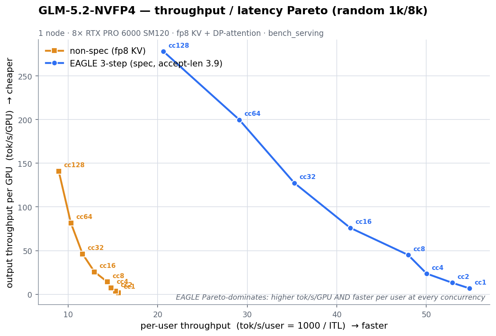
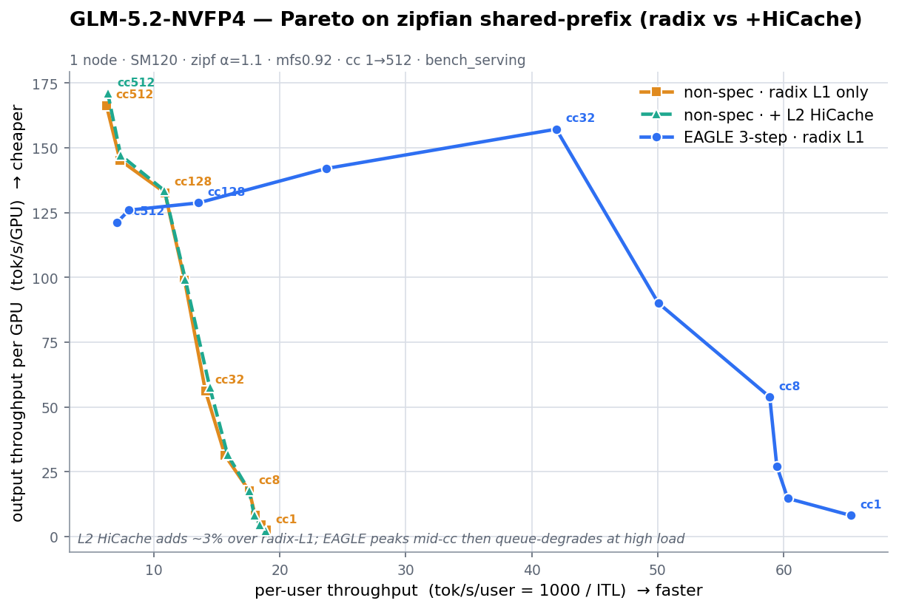

# GLM-5.2-NVFP4 — Concurrency-sweep Pareto curves

Single node (8× RTX PRO 6000 SM120), ISL 1,024 / OSL 8,192, `sglang.bench_serving`, glm-opt build, fp8_e4m3 KV + DP-attention. Throughput is **output tok/s per GPU** (aggregate ÷ 8). Two workloads: random (no shared prefix, no cache benefit) and zipfian shared-prefix (radix L1 vs +L2 HiCache).

---

## 1. Random 1k/8k — EAGLE vs non-spec (the clean Pareto)

`--dataset-name random`, `--random-range-ratio 1.0`, `num_prompts = 2×cc`, `mem-fraction-static 0.92`.

| concurrency | **EAGLE** tok/s/GPU | EAGLE ITL ms | EAGLE TTFT ms | non-spec tok/s/GPU | non-spec ITL ms | non-spec TTFT ms |
|---:|---:|---:|---:|---:|---:|---:|
| 1   | **6.83**   | 18.2 | 570    | 1.95   | 64.2  | 547    |
| 2   | **13.17**  | 18.9 | 752    | 3.81   | 65.4  | 786    |
| 4   | **23.68**  | 20.0 | 757    | 7.39   | 67.6  | 752    |
| 8   | **45.02**  | 20.8 | 1,316  | 14.31  | 69.7  | 1,475  |
| 16  | **76.13**  | 24.1 | 1,988  | 25.75  | 77.4  | 1,872  |
| 32  | **127.45** | 28.4 | 2,653  | 46.18  | 86.3  | 2,798  |
| 64  | **199.79** | 34.4 | 4,553  | 81.62  | 97.2  | 6,514  |
| 128 | **277.97** | 48.5 | 19,180 | 141.0  | 112.0 | 12,040 |

EAGLE accept-length holds ~3.9 across the sweep. **EAGLE Pareto-dominates everywhere**: at every concurrency it delivers higher throughput *and* lower inter-token latency. At cc=1 it is ~3.5× the throughput at ~3.5× lower ITL (the spec latency win); at cc=128 it is ~2.0× the throughput. Both curves are still climbing at cc=128 (neither has hit its KV-pool ceiling on this no-cache workload at mfs0.92).

**Throughput–latency Pareto** — y = output tok/s/GPU, x = per-user tok/s (= 1000 / mean ITL); up-and-to-the-right is better. EAGLE's curve sits entirely above and right of the baseline:

(plot source: [`plot_pareto.py`](./plot_pareto.py))

---

## 2. Zipfian shared-prefix — radix (L1) vs +HiCache (L2)

`--dataset-name generated-shared-prefix --gsp-group-distribution zipf --gsp-zipf-alpha 1.1`, ~896-tok shared prefix + ~133-tok question (ISL≈1,024), OSL 8,192, `mem-fraction-static 0.92`, count scaled per-cc via `num_groups × 6`. "no-HiCache" = radix L1 only; "with-HiCache" = radix L1 + L2 host tier (`--enable-hierarchical-cache`, layer_first/kernel).

### 2a. Non-spec: L2 HiCache adds only ~3% over radix-L1

| cc | groups | no-HiCache tok/s/GPU | hit% | **+HiCache** tok/s/GPU | hit% | Δ |
|---:|---:|---:|---:|---:|---:|---:|
| 1   | 1  | 2.37   | 55.8 | 2.36   | 0.0  | ~0 |
| 2   | 2  | 4.62   | 14.0 | 4.60   | 14.1 | ~0 |
| 4   | 3  | 8.13   | 28.2 | 8.10   | 28.0 | ~0 |
| 8   | 4  | 17.54  | 28.0 | 17.53  | 28.1 | ~0 |
| 16  | 8  | 31.21  | 31.5 | 31.58  | 31.2 | +1% |
| 32  | 16 | 56.17  | 42.0 | 57.52  | 42.0 | +2% |
| 64  | 32 | 98.92  | 44.2 | 99.30  | 44.2 | ~0 |
| 128 | 48 | 132.73 | 46.0 | 133.45 | 46.9 | +1% |
| 256 | 48 | 145.25 | 57.1 | 147.15 | 64.4 | +1% |
| 512 | 48 | 166.34 | 60.1 | **171.09** | 65.9 (device 98%) | **+3%** |

**Finding:** the GPU-side **radix cache (L1) already captures the prefix reuse** on this 1k/8k shape — the L2 HiCache host tier adds only ~+3% at the very top of the range (where L1 starts evicting under decode-KV pressure) and is a no-op below that. HiCache's win is a prefill/TTFT reduction; it **cannot dedup the decode-generated KV** that bounds high-concurrency throughput. For this workload, radix L1 alone is sufficient and L2 HiCache is largely redundant.

### 2b. EAGLE on zipfian (radix L1)

| cc | tok/s/GPU | accept-len | ITL ms | TTFT ms |
|---:|---:|---:|---:|---:|
| 1   | 8.1    | – | 15.3 | 954 |
| 2   | 14.69  | 3.97 | 16.6 | 956 |
| 4   | 27.1   | 3.84 | 16.8 | 932 |
| 8   | 53.79  | 3.81 | 17.0 | 1,266 |
| 16  | 90.08  | 3.91 | 20.0 | 2,072 |
| 32  | **157.2** | 3.94 | 23.8 | 3,127 |
| 64  | 142.03 | 3.92 | 42.2 | 65,775 |
| 128 | 128.75 | 3.92 | 73.8 | 229,904 |
| 256 | 125.93 | 3.89 | 124.5 | 269,787 |
| 512 | 121.31 | 3.90 | 28.1 | 221,555 |

EAGLE on the cache workload **peaks at cc≈32 (157 tok/s/GPU) then declines** as concurrency climbs — its smaller draft+verify KV pool saturates earlier, and TTFT blows up past cc=64 (the queue forms while each forward does spec work). The non-spec config keeps climbing to 166–171 at cc=512. So on a heavily-prefixed workload at extreme over-subscription the two converge; **EAGLE's advantage is concentrated at low-to-mid concurrency** (cc ≤ 32), exactly where its latency win is also largest.

> Note: the zipfian throughput values are `bench_serving` whole-run averages on the small per-cc prompt counts (ramp/drain included) and run at mfs0.92, so they sit below the headline max-batch/steady-state SOTA numbers (194.6 / 300) — they characterize *scaling shape and the cache effect*, not the peak.

### 2d. Zipfian Pareto

y = tok/s/GPU, x = per-user tok/s. The non-spec radix-L1 (squares) and +HiCache (triangles) curves nearly coincide — the ~3% L2 gain is barely visible. EAGLE (circles) is up-and-right at low-to-mid cc, then folds back down-left past cc≈32 as TTFT/queue degrade:

### 2c. EAGLE + HiCache — NOT RUN
The 4th curve (EAGLE + L2 HiCache, zipfian) did not execute — the node-4 sequential A→B handoff didn't fire after the non-spec+HiCache sweep. Launch scripts are staged at `node-4:~/glm52_runs/zipfsweepv2_eagle_HC/`; re-run to complete the 2×2. Given (2a) showed L2 adds ~3% on non-spec, the expected EAGLE+HiCache delta over EAGLE+radix-L1 is similarly small.

---

## Takeaways
1. **EAGLE 3-step is the deployment pick** — Pareto-dominant on no-cache random across all concurrency, and the latency winner.
2. **L2 HiCache is optional for 1k/8k** — radix L1 captures the shared-prefix benefit; L2 adds only a few % at the very high end. Enable it only if your working set of distinct prefixes genuinely overflows the GPU radix tree.
3. **High-concurrency throughput is decode-KV-bound, not prefill-bound** — neither caching nor spec changes the fundamental pool ceiling at OSL=8192; both win by being more efficient *per request*, which matters most at low-to-mid load.
